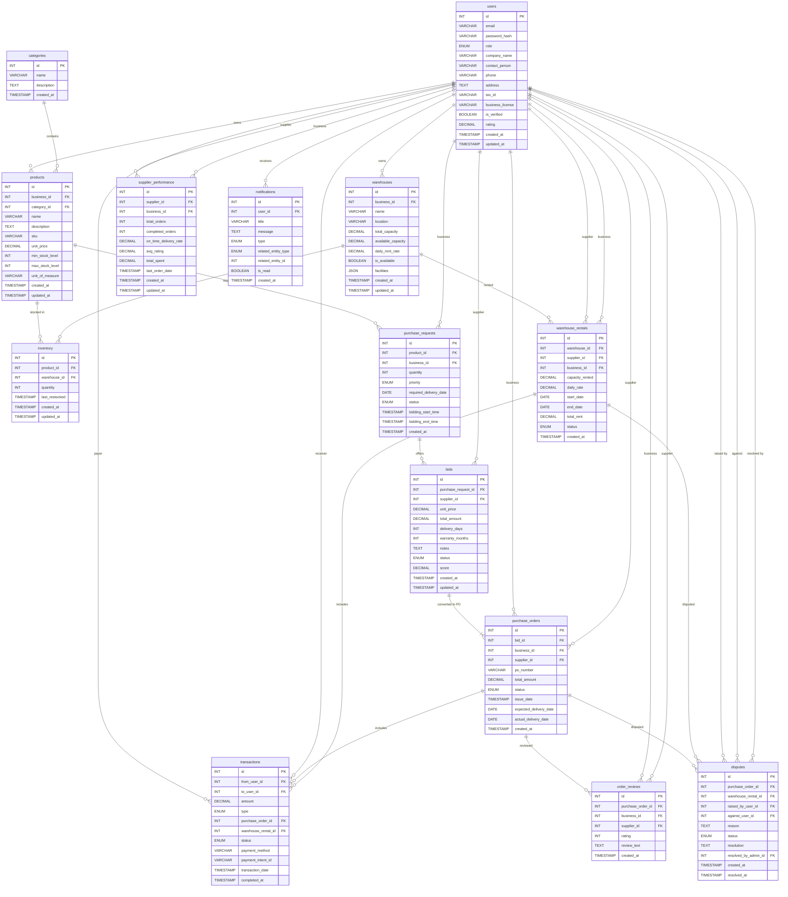

# BidStock ER Diagram

```mermaid
erDiagram

    %% ======================
    %% USERS & CORE ENTITIES
    %% ======================

    users {
        INT id PK
        VARCHAR email
        VARCHAR password_hash
        ENUM role
        VARCHAR company_name
        VARCHAR contact_person
        VARCHAR phone
        TEXT address
        VARCHAR tax_id
        VARCHAR business_license
        BOOLEAN is_verified
        DECIMAL rating
        TIMESTAMP created_at
        TIMESTAMP updated_at
    }

    categories {
        INT id PK
        VARCHAR name
        TEXT description
        TIMESTAMP created_at
    }

    products {
        INT id PK
        INT business_id FK
        INT category_id FK
        VARCHAR name
        TEXT description
        VARCHAR sku
        DECIMAL unit_price
        INT min_stock_level
        INT max_stock_level
        VARCHAR unit_of_measure
        TIMESTAMP created_at
        TIMESTAMP updated_at
    }

    warehouses {
        INT id PK
        INT business_id FK
        VARCHAR name
        VARCHAR location
        DECIMAL total_capacity
        DECIMAL available_capacity
        DECIMAL daily_rent_rate
        BOOLEAN is_available
        JSON facilities
        TIMESTAMP created_at
        TIMESTAMP updated_at
    }

    inventory {
        INT id PK
        INT product_id FK
        INT warehouse_id FK
        INT quantity
        TIMESTAMP last_restocked
        TIMESTAMP created_at
        TIMESTAMP updated_at
    }

    purchase_requests {
        INT id PK
        INT product_id FK
        INT business_id FK
        INT quantity
        ENUM priority
        DATE required_delivery_date
        ENUM status
        TIMESTAMP bidding_start_time
        TIMESTAMP bidding_end_time
        TIMESTAMP created_at
    }

    bids {
        INT id PK
        INT purchase_request_id FK
        INT supplier_id FK
        DECIMAL unit_price
        DECIMAL total_amount
        INT delivery_days
        INT warranty_months
        TEXT notes
        ENUM status
        DECIMAL score
        TIMESTAMP created_at
        TIMESTAMP updated_at
    }

    purchase_orders {
        INT id PK
        INT bid_id FK
        INT business_id FK
        INT supplier_id FK
        VARCHAR po_number
        DECIMAL total_amount
        ENUM status
        TIMESTAMP issue_date
        DATE expected_delivery_date
        DATE actual_delivery_date
        TIMESTAMP created_at
    }

    warehouse_rentals {
        INT id PK
        INT warehouse_id FK
        INT supplier_id FK
        INT business_id FK
        DECIMAL capacity_rented
        DECIMAL daily_rate
        DATE start_date
        DATE end_date
        DECIMAL total_rent
        ENUM status
        TIMESTAMP created_at
    }

    transactions {
        INT id PK
        INT from_user_id FK
        INT to_user_id FK
        DECIMAL amount
        ENUM type
        INT purchase_order_id FK
        INT warehouse_rental_id FK
        ENUM status
        VARCHAR payment_method
        VARCHAR payment_intent_id
        TIMESTAMP transaction_date
        TIMESTAMP completed_at
    }

    supplier_performance {
        INT id PK
        INT supplier_id FK
        INT business_id FK
        INT total_orders
        INT completed_orders
        DECIMAL on_time_delivery_rate
        DECIMAL avg_rating
        DECIMAL total_spent
        TIMESTAMP last_order_date
        TIMESTAMP created_at
        TIMESTAMP updated_at
    }

    order_reviews {
        INT id PK
        INT purchase_order_id FK
        INT business_id FK
        INT supplier_id FK
        INT rating
        TEXT review_text
        TIMESTAMP created_at
    }

    disputes {
        INT id PK
        INT purchase_order_id FK
        INT warehouse_rental_id FK
        INT raised_by_user_id FK
        INT against_user_id FK
        TEXT reason
        ENUM status
        TEXT resolution
        INT resolved_by_admin_id FK
        TIMESTAMP created_at
        TIMESTAMP resolved_at
    }

    notifications {
        INT id PK
        INT user_id FK
        VARCHAR title
        TEXT message
        ENUM type
        ENUM related_entity_type
        INT related_entity_id
        BOOLEAN is_read
        TIMESTAMP created_at
    }

    %% ======================
    %% RELATIONSHIPS
    %% ======================

    users ||--o{ products : "owns"
    categories ||--o{ products : "contains"

    users ||--o{ warehouses : "owns"

    products ||--o{ inventory : "stocked in"
    warehouses ||--o{ inventory : "stores"

    products ||--o{ purchase_requests : "requested"
    users ||--o{ purchase_requests : "business"

    purchase_requests ||--o{ bids : "offers"
    users ||--o{ bids : "supplier"

    bids ||--|{ purchase_orders : "converted to PO"
    users ||--o{ purchase_orders : "business"
    users ||--o{ purchase_orders : "supplier"

    warehouses ||--o{ warehouse_rentals : "rented"
    users ||--o{ warehouse_rentals : "supplier"
    users ||--o{ warehouse_rentals : "business"

    users ||--o{ transactions : "payer"
    users ||--o{ transactions : "receiver"
    purchase_orders ||--o{ transactions : "includes"
    warehouse_rentals ||--o{ transactions : "includes"

    users ||--o{ supplier_performance : "supplier"
    users ||--o{ supplier_performance : "business"

    purchase_orders ||--o{ order_reviews : "reviewed"
    users ||--o{ order_reviews : "business"
    users ||--o{ order_reviews : "supplier"

    purchase_orders ||--o{ disputes : "disputed"
    warehouse_rentals ||--o{ disputes : "disputed"
    users ||--o{ disputes : "raised by"
    users ||--o{ disputes : "against"
    users ||--o{ disputes : "resolved by"

    users ||--o{ notifications : "receives"
```